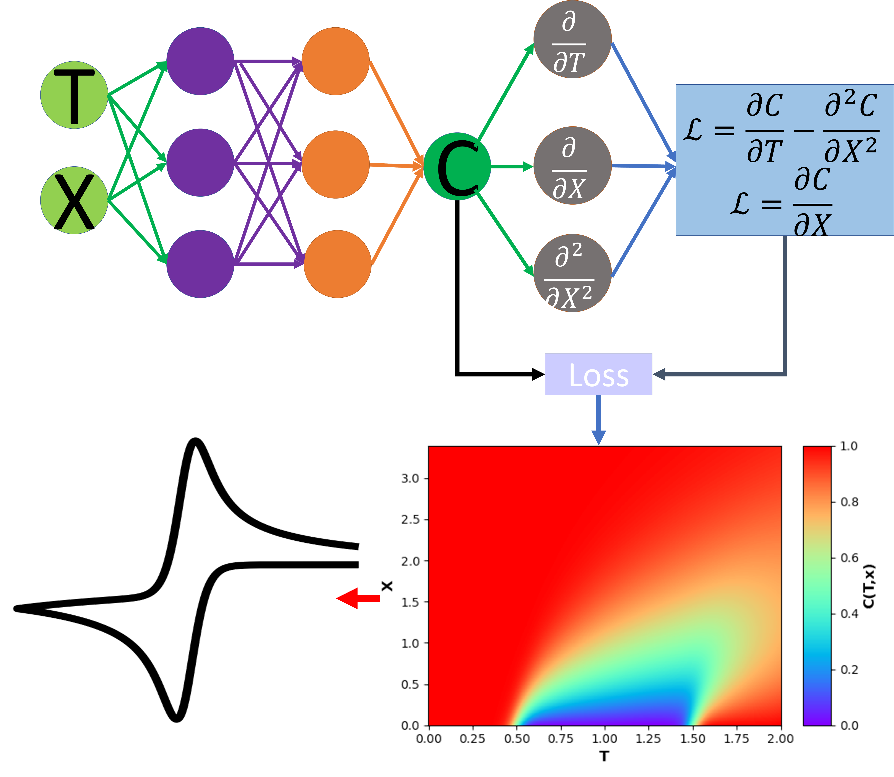

# PINN-CV
 
This is a code repository in company with "Predicting Voltammetry using Physics-Informed Neural Networks" submitted to the *Journal of Physical Chemistry Letters* 



# Requirements
Python 3.7 and above is suggested to run the program. The neural networks was developed and tested with Tensorflow 2.3. To install required packages, run

```
$ pip install -r requirement.txt

```

# Content
This repository has four folders for the four cases illustrated in the paper. They are: 

* 1D Semi-Infinite: 1D simulation of cyclic voltammetry with semi-infinite boundary condition
* 1D Thin-Layer: 1D simulation at thin layer cyclic voltammetry
* 2D Microband: 2D simulation cyclic voltammetry at microband electrode
* 2D Square Electrode: 2D simulation of cyclic voltammetry at a square electrode


# Issue Reports
Please report any issues/bugs of the code in the discussion forum of the repository or contact the corresponding author of the paper


# Cite
To cite, please refer to:
(Cite Information not available yet)


